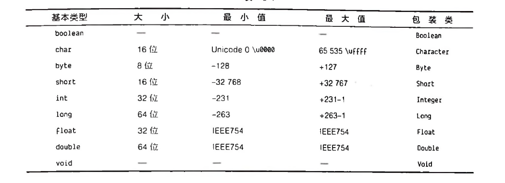
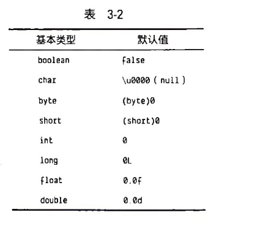

java将一切都视为对象
始终在创建引用时就进行初始化
String s = new String("fll")
数据保存在哪里
    1. 寄存器
    2. 栈stack  Java必须明确栈上所有对象的生命周期
    3. 堆heap   使用new创建对象，Java会在堆上为该对象分配内存空间
    4. 常量存储
    5. 非RAM存储

对于基本类型，java使用了和c和c++一样的实现机制，无须使用new来创建基本类型的变量，而是直接创建一个自动变量，注意不是引用。
也就是说，该变量会直接在栈上保存它的值，因此运行效率也高。

java定义了每一种基本类型所占用的空间大小，即便是在不用的机器上，这些类型所占用的空间也是一致的，更好的移植。

此外，JAVA还为基本类型提供了对应的包装类，通过包装类可以将基本数据类型呈现为位于堆上的非原始对象。

高精度数字，可以去了解BigInteger和BigDecimal两个包装类，没有基本数据类型。

Java数组一定会被初始化，并且无法访问数组边界之外的元素。
虽然边界检查需要消耗内存和时间的，但是可以接受。

注释：
    多行注释  /*     */
    单行注释： //

作用域：
    在该作用域（即{}）里定义的变量只在该作用于的范围内可见，

对象的生命周期和基本类型有所不同，当你使用new创建一个对象时，该对象会在其作用域结束后依然存在，但是其引用却消失了，对于c,c++就必须释放内存，java有垃圾回收机制，可以自动对没有引用的对象进行回收。

我们可以通过关键字class来创建一个类。
通过new关键字创建一个该类的对象。
ATypeName a = new ATypeName();
可以在类中定义数据成员和成员函数。
可以用对象的引用名，跟着一个“."，然后是对象成员名，为数据成员赋值。
如果一个对象包含了其他对象，我们还可以继续套娃

当一个类的字段是基本类型时，即使你没有初始化这些字段，它们也有默认值。

方法：
返回值  方法名（参数列表）{
    方法体
}
方法名和参数列表共同构成了方法的“签名”，即该方法的唯一标识符。

java中的方法只能作为类的一部分而存在，方法只能通过对象调用。

对象引用之后添加一个“."，然后紧跟着方法名及其参数列表
Object.method(arg1,arg2.arg3);

名称可见性
C++将函数放在类中，因此一个类的函数名不会与其他类的同名函数发生冲突，C++依然允许使用全局数据和全局函数，因此潜在的冲突依然存在，为此引入了命名空间的概念。

Java泽使用反转的url来定义命名空间。

import关键字告知Java编译器你想要使用哪个类

经常使用编译器自带的各种Java标准库组件，如

import java.util.ArratList

这一行代码会告诉编译器，你要使用位于util库的ArrayList类
当然，你可以使用

import java.util.*

导入所有类

static关键字

创建一个类，即描述了其对象的外观和行为。直到使用new关键字时，你才会真正创建一个对象，以及为该对象分配内存，并使得其方法可以被调用。

但有时候，我们会需要一个共享空间来保存数据或方法，而不关心是否有没有对象

static关键字的字段和方法不依赖于任何对象，即便你没有为一个类创建对象，依然可以调用该类的static方法和static字段。对于非static的字段和方法来说，你必须创建创建一个对象才可以使用非static的字段或方法。也就是说，static为类数据和类方法。

即便你创建了多个对象，依然会只有一份static数据或方法，占用同一块内存空间，被所有对象所共享。可以通过对象或类名来调用static修饰的数据和方法。

java会自动动如一个特定的库，即java.lang
可以查看Oracle公司给出的文档

需要注意的是，文件中必须存在一个与该文件同名的类，
如果你需要创建一个能够独立允许的程序，那么与文件同名的类中还必须包含一个程序启动的入口方法，即main()方法

编译风格：

驼峰命名法

类名首字母大写，如果类名包含多个词，每一个词的首字母大写
方法、字段、对象除了首字母小写外，使用的命名方式和类名一样。

