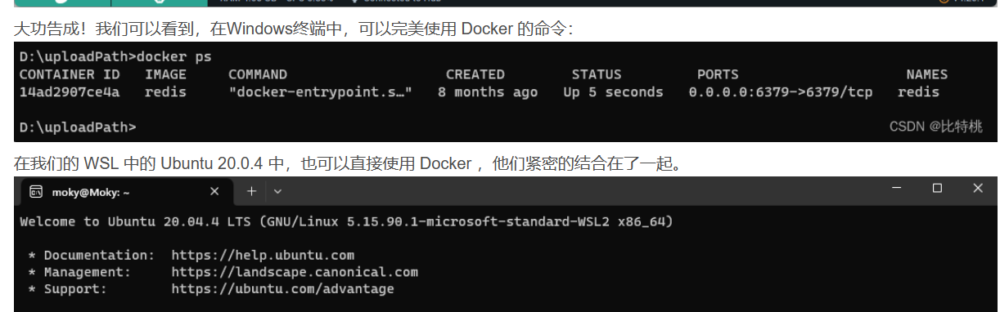

首先，在windows上安装Linux子系统WSL，安装docker，安装成功后：

本文通过微软为我们提供更高效的 WSL ，安装 Windows下的子系统。从而实现了 Docker 所依赖的 Linux 内核的需要，通过 Docker Desktop 软件，配置集成了我们 WSL 中的 Linux 子系统。在 Windows 中一体化的使用，也节省了大量的使用虚拟机所产生的计算资源。

## 拉取一个镜像
docker pull pytorch/torchserve:0.7.0-gpu

## 启动docker容器，将本地路径映射到docker

