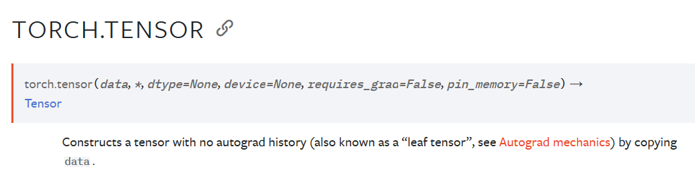
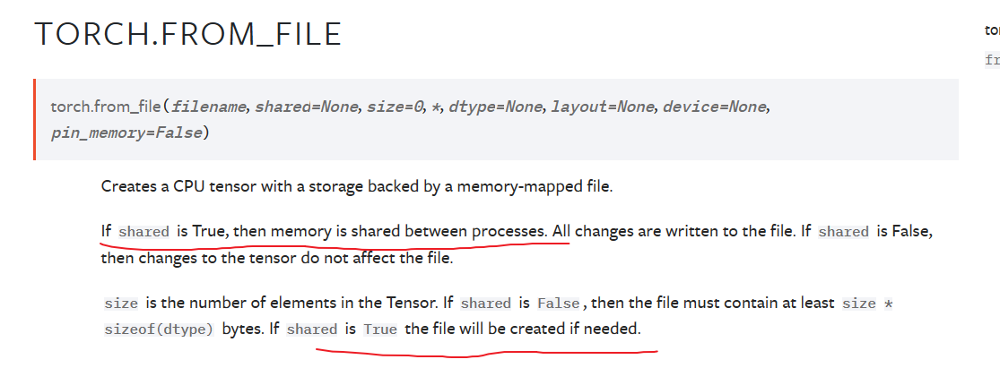
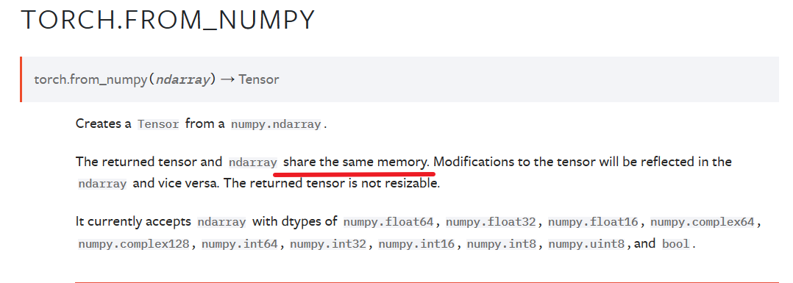
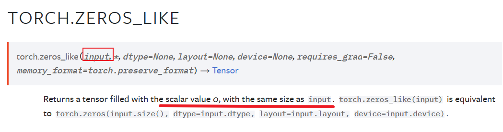
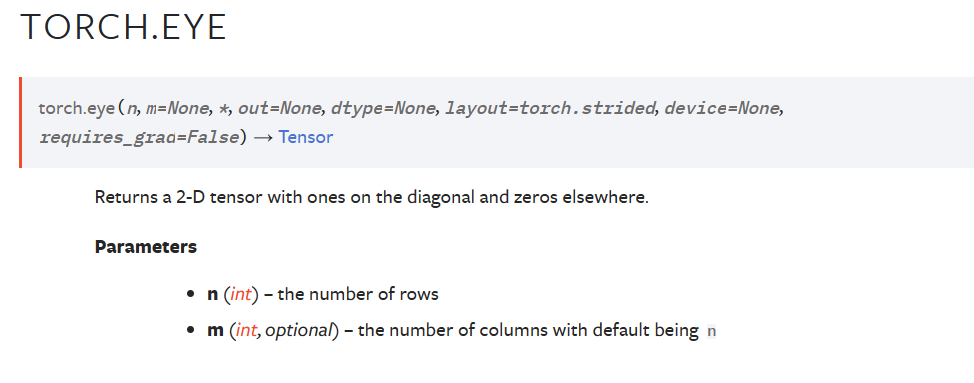

torch包包含多维张量的数据结构，并定义这些张量上的数学运算。

此外，它还提供了许多实用程序，用于张量和任意类型的高效序列化，以及其他有用的实用程序。

tensor 分为头信息区(Tensor)和存储区(Storage)。

信息区(Tensor)主要存储tensor的形状(size)、步长(stride)、数据类型(type)等信息，其真正的数据保存为连续数组，存储在存储区(Storage)中。

一般来说pytorch中tensor的数据很大，可能是成千上万的，所以我们信息区(Tensor)一般来说占用的内存比较少，主要内存的占用取决于tensor中元素的数目，也就是存储区(Storage)的大小。
```

import torch

a = torch.rand(3, 5)
print(a)
# a.storage()将被丢弃，a.untyped_storage()来代替。
print(a.storage())
b = a.untyped_storage()
print(a.is)
tensor([[0.5572, 0.2308, 0.5311, 0.5901, 0.9444],
        [0.0053, 0.3987, 0.5092, 0.5241, 0.8213],
        [0.7216, 0.4833, 0.9023, 0.6109, 0.1553]])

 0.5572177171707153
 0.23083359003067017
 0.5311199426651001
 0.5900749564170837
 0.944441556930542
 0.00533062219619751
 0.39870399236679077
 0.5092213749885559
 0.5241267085075378
 0.8212704062461853
 0.7215670943260193
 0.4833354949951172
 0.9022901654243469
 0.6109415888786316
 0.1552547812461853
[torch.storage.TypedStorage(dtype=torch.float32, device=cpu) of size 15]
```

is_tensor()  :obj是否为tensor

is_storage() :obj是否为storage

is_floating_point(): obj是否是float类型，
one of torch.float64, torch.float32, torch.float16, and torch.bfloat16

is_nonzero(): 如果input只有一个元素且不为0则返回true

set_default_dtype():  设置默认的类型

get_default_dtype():  得到默认的类型

set_default_device(): 设置默认的device


numel(): 返回输入张量的元素个数

set_printoptions(): 设置打印格式，可以设置精度，等等吧


tensor(): 创建一个张量

创建一个稀疏矩阵：
* sparse_coo_tensor
* sparse_csr_tensor
* sparse_csc_tensor
* sparse_bsr_tensor
* sparse_bsc_tensor




将一个对象转为一个tensor，copy=True，则复制一份，否则共享内存。









多了一个base参数

返回一个单位矩阵



